# Technical Documentation

## 1. Overview

**System Purpose**: 
Feature importance identification through parallel-validation approach: run statistical significance tests and ML-based feature importance separately, then allow users to select which ranking to use for downstream model training. All components (Model Training, AI Agent Chat) consume the same analysis results from Session State for consistency.

**Core Design Principles**:

1. **Shared Analysis Cache**: Streamlit UI → Data Processing → Analysis (statistical/ML parallel) → Session State. Downstream consumers (Model Training, AI Agent Chat) both read from shared `analysis_results` cache.

2. **Branching Consumption Pattern**: Analysis layer produces once, consumed multiple ways: Model Training selects one feature ranking; AI Agent Chat receives all results for context-aware queries. Eliminates duplicate analysis.

3. **Parallel Feature Ranking**: Two independent ranking methods run separately (user can select both in Advanced Analysis tab, but they don't influence each other). Both rankings stored in Session State for flexible use.

4. **Extensible Analysis Methods**: Add new statistical tests in `statistical_analyzer.py` (all inherit from `analyze_feature()` pattern). ML feature importance plugs in via `FeatureImportanceAnalyzer` with AutoGluon backend.

5. **Session State Management**: Cross-page state sharing enables both sequential (Configuration → Analysis → Training) and parallel (Model Training + Chat both consume Analysis) workflows without database.

6. **Agent as Result Consumer**: AI Chat interface (via `StatisticalAgent`) receives preprocessed data + analysis results via `set_data_context()` and `set_analysis_results()`. Tool functions query both to answer user questions; encapsulation prevents hallucination.

## 2. Architecture

### 2.1 Module Organization

System composed of independent modules that communicate via Session State (shared cache).

**Data Processing Module** (`src/data_processing/`):
- `DataLoader`: CSV → DataFrame with basic type detection
- `DataPreprocessor`: Missing value handling, categorical encoding, scaling, OK/KO label creation
- **Output Schema**:
  ```python
  processed_df: DataFrame  # Features + OK_KO_Label column (preprocessed)
  ```
  Stored in Session State: `st.session_state.processed_df`

**Analysis Module** (`src/analysis/`):
- Statistical Analyzer (`statistical_analyzer.py`):
  - Runs independently on `processed_df`
  - Per-feature: T-test (numeric) / Mann-Whitney U (numeric robust) / Chi-square (categorical)
  - Compute: p-value, effect size (Cohen's d or Cramér's V), composite score
  - Output:
    ```python
    feature_ranking: List[Dict]  # [{'feature': 'Sex', 'p_value': 0.0001, 'effect_size': 0.54, 'score': 14.2}, ...]
    statistical_summary: Dict  # Per-feature stats (mean, std, etc.)
    ```
- ML Feature Importance (`feature_importance.py`):
  - Runs independently on `processed_df`
  - Train AutoGluon TabularPredictor (ensemble)
  - Extract permutation-based feature importance
  - Output:
    ```python
    feature_importance: Dict  # {
      'feature_ranking': [{'feature': 'Sex', 'importance': 0.285}, ...],
      'model_leaderboard': DataFrame,  # Model names, accuracy, training time
      'best_model': str,  # 'WeightedEnsemble_L2'
      'training_time': float
    }
    ```
- Data Merging:
  - Both Statistical and ML analyzers called independently in Advanced Analysis page
  - Results merged into single `analysis_results` dict in Session State:
    ```python
    analysis_results: Dict  # {
      'feature_ranking': [...],  # Statistical ranking
      'ml_feature_importance': {...},  # ML ranking + leaderboard
      'statistical_summary': {...}
    }
    ```

**UI Module** (`src/app/app_pages/`):
- 6 independent pages: configuration, data_overview, data_analysis, advanced_analysis, model_training, ai_agent
- Stateless pages (no local state)
- Read/write only via Session State
- No business logic; display + input handling only

**Agent Module** (`src/agent/`):
- Components:
  - `StatisticalAgent`: Intent parser (rule-based + LLM fallback) → route to tool functions
  - `LLMInterface`: Multi-backend LLM wrapper (Ollama/OpenAI/Claude/Gemini/DeepSeek)
  - `ConversationManager`: Chat history + context
- Data Source: `processed_df` + `analysis_results` from Session State
- Tool Functions (called by Agent):
  - `get_feature_importance()` → reads `analysis_results['feature_ranking']` or `analysis_results['ml_feature_importance']`
  - `get_statistical_summary()` → reads `analysis_results['statistical_summary']`
  - `plot_distribution()` → reads `processed_df`
- Visualization Utilities (`plotting_tools.py`):
  - Functions: `plot_time_series()`, `plot_frequency_spectrum()`, `plot_distribution_comparison()`, etc.
  - Stateless utility functions, called by: UI pages (Data Analysis) + Agent tool functions (Chat)
  - Input: DataFrame → Output: Matplotlib/Plotly figure object
- Output: Structured result (plot + text summary) to chat

### 2.2 Session State Data Flow

Session State is the **single source of truth** for all modules:

```
Step 1: Configuration Page
  CSV → DataPreprocessor → Session State: {processed_df}

Step 2: Data Analysis Page
  Read: processed_df
  Display: distributions, correlations, basic statistics
  No write to Session State (display only)

Step 3: Advanced Analysis Page
  Parallel execution:
    Thread A: StatisticalAnalyzer → {feature_ranking, statistical_summary}
    Thread B: FeatureImportanceAnalyzer → {feature_importance, leaderboard, best_model, training_time}
  Merge → Session State: {analysis_results}

Step 4: Model Training Page
  Read: processed_df + analysis_results
  User selects: Statistical or ML feature source
  Train: Logistic, SVM, Tree, RandomForest on top-N subsets
  → Session State: {training_results, model_performance, best_model}

Step 5: AI Agent Chat Page
  Read: processed_df + analysis_results
  User query → StatisticalAgent routes to tool functions:
    • feature importance: analysis_results['feature_ranking']
    • feature stats: analysis_results['statistical_summary']
    • distribution plot: processed_df columns
  Output: plot + text to chat (no Session State write)
```

## 3. Design Choices & Implementation Details

### 3.1 Statistical Analysis

**Feature Classification & Processing**:
- Features automatically classified as **Numerical** (int64, float64) or **Categorical** (object, category)
- Excluded from analysis: ID columns, time/index columns (`time_cycle`, `cycle`, `timestamp`)
- Data split into two groups: OK samples vs KO samples

**Numerical Features Analysis**:
- Test selection: T-test (parametric) + Mann-Whitney U (non-parametric robust) + Kolmogorov-Smirnov (distribution)
- **Significance threshold**: α=0.05 (p-value < 0.05 = significant difference)
- **Effect Size (Cohen's d)**:
  ```
  d = (mean_OK - mean_KO) / pooled_std
  pooled_std = sqrt(((n_OK-1)·var_OK + (n_KO-1)·var_KO) / (n_OK + n_KO - 2))
  ```
  Interpretation: |d| > 0.8 (large), 0.5-0.8 (medium), 0.2-0.5 (small), < 0.2 (negligible)
- **Difference Ratio**:
  ```
  difference_ratio = |mean_OK - mean_KO| / max(|mean_OK|, |mean_KO|)
  ```
  Captures relative magnitude of difference (0-1 scale, normalized by larger mean)

**Categorical Features Analysis**:
- **Chi-square Test**: Tests independence between feature categories and OK/KO labels
  ```
  χ² = Σ (observed - expected)² / expected
  ```
  Builds contingency table (categories × OK/KO) and computes statistic
- **Significance threshold**: α=0.05 (p-value < 0.05 = significant association)
- **Effect Size (Cramér's V)**:
  ```
  V = sqrt(χ² / (n × (k-1)))
  where k = min(rows, cols) in contingency table, n = total samples
  ```
  Interpretation: V > 0.5 (strong), 0.3-0.5 (medium), 0.1-0.3 (weak), < 0.1 (negligible)

**Feature Ranking via Composite Score**:
Combines three orthogonal measures into single discriminative power score:
```
composite_score = -log₁₀(p_value) × |effect_size| × difference_ratio
```

Components breakdown:
1. **-log₁₀(p_value)**: Converts p-value to significance strength (smaller p → larger score)
   - p=0.05 → score=1.3
   - p=0.001 → score=3.0
   - p<0.0001 → score≥4.0
2. **|effect_size|**: Practical significance (Cohen's d or Cramér's V)
   - Prevents selecting statistically significant but practically negligible features
3. **difference_ratio**: Normalized mean/distribution shift
   - Ensures cross-feature comparability (prevents scale bias)

**Composite Score in Action**:
The composite score formula combines statistical significance, practical effect size, and normalized difference into a single ranking metric. See Section 4.2 for real examples with actual calculations.

**Statistical Summary Output Structure**:
Per-feature analysis returns nested dictionary organized as:

**For Numerical Features** (`numerical_results[feature_name]`):
```python
{
  'ok_stats': {
    'count': int,              # Sample size in OK group
    'mean': float,             # Arithmetic mean
    'median': float,           # Median (50th percentile)
    'mode': float,             # Most frequent value
    'std': float,              # Standard deviation
    'var': float,              # Variance
    'min': float,              # Minimum value
    'max': float,              # Maximum value
    'q1': float,               # 25th percentile
    'q3': float,               # 75th percentile
    'skewness': float,         # Distribution skew (-∞ left-skewed, 0 symmetric, +∞ right-skewed)
    'kurtosis': float          # Distribution tail weight (0 normal, +ve heavy tails, -ve light tails)
  },
  'ko_stats': {same structure},
  'statistical_tests': {
    't_test': {'t_statistic': float, 'p_value': float, 'significant': bool},
    'mannwhitney_test': {'u_statistic': float, 'p_value': float, 'significant': bool},
    'ks_test': {'ks_statistic': float, 'p_value': float, 'significant': bool}
  },
  'effect_size': float,        # Cohen's d (−∞ to +∞, |d|>0.8 large effect)
  'difference_ratio': float    # Normalized mean difference (0-1 scale)
}
```

**For Categorical Features** (`categorical_results[feature_name]`):
```python
{
  'ok_distribution': dict,     # {category: proportion, ...} for OK group
  'ko_distribution': dict,     # {category: proportion, ...} for KO group
  'chi2_test': {
    'chi2_statistic': float,   # χ² test statistic
    'p_value': float,          # Significance level
    'degrees_of_freedom': int,
    'significant': bool        # True if p_value < 0.05
  },
  'cramers_v': float,          # Cramér's V effect size (0-1, >0.5 strong)
  'contingency_table': dict    # {ok_count, ko_count} per category
}
```

**Complete Analysis Results** (merged into Session State):
```python
analysis_results: {
  'feature_ranking': [
    {'feature': str, 'type': 'numerical'|'categorical', 'p_value': float, 
     'effect_size': float, 'difference_ratio': float, 'composite_score': float, 
     'significant': bool},
    ...
  ],
  'numerical_analysis': {feature_name: {ok_stats, ko_stats, tests, ...}, ...},
  'categorical_analysis': {feature_name: {ok_dist, ko_dist, chi2_test, ...}, ...},
  'summary': {
    'total_samples': int,
    'ok_samples': int,
    'ko_samples': int,
    'numerical_features': int,
    'categorical_features': int
  }
}
```

### 3.2 ML Feature Importance (AutoGluon)

**AutoGluon Training Pipeline** (`FeatureImportanceAnalyzer.analyze_feature_importance()`):

**Input Parameters**:
- `df`: Preprocessed DataFrame with features + OK_KO_Label
- `target_col`: Default 'OK_KO_Label' (binary classification: OK vs KO)
- `time_limit`: Training time budget in seconds (default 120s)
- `preset`: Quality-speed tradeoff ('best_quality', 'high_quality', 'medium_quality', 'good_quality', 'fast_training')
- `save_path`: Model save directory (default 'autogluon_models_temp')

**Model Training Process**:
1. **Initialize TabularPredictor**:
   ```python
   TabularPredictor(
     label='OK_KO_Label',
     eval_metric='accuracy',  # Optimize for accuracy (not AUC, F1, etc.)
     path='autogluon_models_temp',  # Model directory for disk persistence
     verbosity=2
   )
   ```
2. **Ensemble Training** (time_limit=120s, preset='medium_quality'):
   - AutoGluon automatically trains multiple base models in parallel:
     - **Tree-based**: LightGBM, XGBoost, CatBoost, RandomForest, ExtraTrees
     - **Neural Networks**: NeuralNetFastAI, NeuralNetTorch
     - **Classical**: Logistic Regression, SVM, KNN (when time permits)
   - Each model cross-validated internally (default 5-fold)
   - Weighted ensemble (`WeightedEnsemble_L2`) stacks best models for final predictions
3. **Session-Scoped Training**: 
   - Predictor object stays in memory during Streamlit session only
   - Cleared on app rerun (standard Streamlit behavior)
   - No cross-session persistence mechanism currently implemented
   - Disk files (`autogluon_models_temp/`) are created by AutoGluon but not actively used for reloading

**Feature Importance Calculation** (Permutation-based):
- After training, importance computed via `predictor.feature_importance(df_ml)`
- **Method**: For each feature, randomly shuffle values in train data → measure accuracy drop
  - Features causing larger accuracy drop = higher importance (more predictive)
  - Normalized to 0-1 scale (total importance ≈ 1.0)
  - **Data Used**: Original training data `df_ml` (WITH potential data quality issues)
- **Important Note on High-Cardinality Features** (CRITICAL):
  - Features with unique value count ≈ sample count rank artificially high and dominate importance scores
  - Reason: These features perfectly memorize individual samples → highest permutation importance
  - **This is NOT predictive importance** - it's an artifact of overfitting to unique identifiers
  - **Current System Gap**: High-cardinality ID/text columns (Name, Ticket, Cabin, PassengerId) should be excluded but currently not implemented
  
**Output Structure** (returned from `analyze_feature_importance`):
```python
{
  'feature_names': List[str],        # Features used in training (ID/time columns excluded)
  'data_shape': Tuple[int, int],     # (num_samples, num_features)
  'class_distribution': dict,        # {label: count, ...} for OK and KO classes
  'feature_importance': {
    'importance_scores': dict,       # AutoGluon feature importance output (to_dict format)
    'feature_ranking': List[Dict]    # [{'feature': str, 'importance': float, 'rank': int}, ...]
  },
  'model_leaderboard': List[dict],   # AutoGluon leaderboard converted to list of dicts (to_dict('records'))
  'best_model': {
    'name': str,                     # Model name from leaderboard (highest score_val)
    'score_val': float,              # Validation score from leaderboard
    'score_test': float or None,     # Test score if available in leaderboard
    'pred_time_val': float or None,  # Prediction time if available in leaderboard
    'fit_time': float or None        # Fit time if available in leaderboard
  },
  'training_time': float             # Total training duration in seconds
}
```

**Preset Behavior & Time Trade-off**:

| Preset | Time Budget | Base Models | Stacking Layers | Speed/Accuracy | Code Usage |
|--------|---|---|---|---|---|
| `fast_training` | ~30s | 5-8 | 1 | ⚡ Fast | `preset='fast_training'` |
| `good_quality` | ~60s | 10-15 | 2 | ⚡⚙️ Balanced | `preset='good_quality'` |
| `medium_quality` | ~120s | 15-20 | 2 | ⚙️ **[SYSTEM DEFAULT]** | `preset='medium_quality'` |
| `high_quality` | ~300s | 25+ | 3 | ⚙️🎯 Accurate | `preset='high_quality'` |
| `best_quality` | ~1800s | 40+ | 3+ | 🎯 Best | `preset='best_quality'` |


### 3.3 Model Training

**Purpose**: Train simple discriminative models to validate feature importance rankings and identify optimal feature subset size.

**Data Source**:
- Preprocessed DataFrame (`processed_df`) with all features + OK_KO_Label column
- Feature ranking from either:
  - Statistical Analysis: `analysis_results['feature_ranking']` (sorted by composite score)
  - ML Feature Importance: `analysis_results['ml_feature_importance']['feature_importance']['feature_ranking']` (sorted by permutation importance)

**Training Pipeline** (`ModelTrainer.train_models_with_feature_selection()`):

**Input Parameters**:
```python
df: pd.DataFrame                           # Preprocessed data (OK_KO_Label already encoded)
feature_importance_ranking: List[str]      # Feature names ordered by importance (best first)
feature_counts: List[int] = [5, 10, 15, 20]  # Top-N subsets to test
model_names: List[str] = ['logistic', 'svm', 'dt', 'rf']  # Model types to train
```

**Step 1: Feature Selection from Ranking**
- For each N in `feature_counts`: Extract top-N features from `feature_importance_ranking`
- Filter to features actually present in DataFrame (warn if missing)
- Create subset X with only these N features

**Step 2: Model Training** (for each (feature_count, model_type) combination):

**Four Model Algorithms**:
1. **Logistic Regression** (`LogisticRegression(max_iter=1000, n_jobs=-1)`)
   - Linear binary classifier; outputs probability scores
2. **SVM with RBF kernel** (`SVC(kernel='rbf', probability=True)`)
   - Non-linear classifier; uses Gaussian kernel for complex decision boundaries
3. **Decision Tree** (`DecisionTreeClassifier()`)
   - Recursive greedy feature splitting; interpretable tree structure
4. **Random Forest** (`RandomForestClassifier(n_estimators=100, n_jobs=-1)`)
   - Ensemble of 100 trees; parallel bagging for robustness

**Training Procedure**:
- One-hot encode categorical columns (auto-detected, `drop_first=True`)
- Fill numerical missing values with median
- 80-20 train-test split (deterministic: `random_state=42`)
- StandardScaler on both train and test (fit on train data only)
- Train model on scaled training data: `model.fit(X_train_scaled, y_train)`

**Step 3: Evaluation on Test Set**
Per model, compute metrics on held-out test data:
- Accuracy, F1, Precision, Recall
- AUC (from `predict_proba` if available)

**Output Structure**:
```python
{
  'success': bool,
  'message': str,                        # Status + best model summary
  'performance_summary': DataFrame,      # All models × feature counts with metrics
  'best_model': {
    'name': str,                         # Best model type (highest accuracy)
    'n_features': int,                   # Number of features used
    'features': List[str],               # Actual feature names
    'accuracy': float,
    'f1': float,
    'precision': float,
    'recall': float,
    'auc': float,
    'y_test': np.array,
    'y_pred': np.array
  },
  'plot_data': {
    'feature_counts': List[int],         # Feature subset sizes tested
    'feature_vs_accuracy': {             # Accuracy trend per model
      'logistic': [0.823, 0.852, 0.845, ...],
      'svm': [...],
      ...
    },
    'model_comparison': {                # Average accuracy across all feature counts
      'logistic': 0.840,
      'svm': 0.831,
      'dt': 0.811,
      'rf': 0.851
    }
  },
  'detailed_results': List[Dict]         # Complete per-model results
}
```

**Key Behaviors**:
- Trains **4 models × N feature_counts** total combinations (e.g., 4 models × 4 feature counts = 16 models)
- Best model selected by highest accuracy on test set
- Feature count impact visible via `feature_vs_accuracy` plot (shows if more features help or plateau)

### 3.4 AI Agent

**Architecture Overview**:
The AI Agent (`StatisticalAgent`) provides natural language interface for dataset analysis through a hybrid rule-based + LLM approach. Core design prevents hallucination: all numerical results are computed by deterministic Python tools; LLM only provides optional natural language interpretation of tool-generated summaries.

**Component Structure**:

**1. StatisticalAgent** ([src/agent/agent_core.py](src/agent/agent_core.py))
- Main orchestrator for query processing and tool dispatch
- Maintains data context (`processed_df`), analysis results (`analysis_results`), and conversation history
- Coordinates LLMInterface (backend communication), ConversationManager (chat state), and PlottingTools (visualization)

**2. LLMInterface** ([src/agent/llm_interface.py](src/agent/llm_interface.py))
- Unified multi-backend LLM wrapper supporting:
  - **Ollama** (local): Default `llama3:latest`, endpoint `http://localhost:11434`
  - **OpenAI**: Default `gpt-3.5-turbo`, requires `OPENAI_API_KEY`
  - **Claude**: Default `claude-3-sonnet-20240229`, requires `ANTHROPIC_API_KEY`
  - **Gemini**: Default `gemini-pro`, requires `GOOGLE_API_KEY`
  - **DeepSeek**: Default `deepseek-chat`, requires `DEEPSEEK_API_KEY`
- API key resolution: parameter → environment variable → None (prompts warning)
- Error handling: connection failures, missing libraries, invalid keys

**3. ConversationManager** ([src/agent/conversation.py](src/agent/conversation.py))
- Manages chat history with configurable max length (default 20 messages)
- Maintains system prompt with current dataset context (column names, OK/KO counts, numerical features)
- Auto-trims history: keeps first message (system prompt) + most recent N messages when limit exceeded
- Adds timestamp metadata to each message for audit trail

**4. PlottingTools** ([src/agent/plotting_tools.py](src/agent/plotting_tools.py))
- Stateless visualization functions (shared with Data Analysis UI page)
- All plot functions return `{'success': bool, 'figure': matplotlib.Figure, 'summary': dict, 'error': str}`
- **Deterministic summaries**: structured facts (statistics, peak frequencies, group comparisons) prevent LLM hallucination
- Robust time axis detection: auto-detect datetime/numeric time columns; fallback to sample index with warning
- Group-aware plotting: auto-resolves group column (`OK_KO_Label` → `fault` → `label` → `class` fallback)

**Query Processing Pipeline**:

**Step 1: Intent Parsing** (`_parse_intent()`)
- **Rule-based pattern matching** (primary method, deterministic):
  - Keyword detection: `["feature importance", "fft", "histogram", "time series", "mean", "variance"]`
  - Column name extraction: word-boundary regex match against `processed_df.columns` (prevents substring false positives)
  - Group filter parsing: detect `["for OK", "OK samples", "KO group"]` → set `filter_group` parameter
  - Plot type inference: `["boxplot", "violin", "kde"]` → select visualization variant
- **Output**: Intent dictionary with tool name and arguments:
  ```python
  {
    'type': 'tool',  # or 'unknown'
    'tool': 'plot_time_series',
    'args': {'column': 'vibration_sensor', 'separate_groups': True, 'filter_group': 'KO'}
  }
  ```
- **LLM fallback** (optional, when `enable_llm_fallback_chat=True`):
  - Triggered only when rule-based parsing returns `'type': 'unknown'`
  - LLM does NOT compute numbers; only suggests correct query syntax
  - System prompt: "Do NOT compute results. Instruct user how to ask using tool keywords like 'mean variance X', 'histogram X'"

**Step 2: Column Disambiguation** (`_resolve_columns()`)
- Handles ambiguous user queries (e.g., "show time series" without column name)
- **Multi-tier fallback strategy**:
  1. **Matched columns** (from user message): If user mentioned specific columns, validate they exist
  2. **Analysis-based selection** (`_get_analysis_based_columns()`):
     - Extract top-N features from `analysis_results['feature_ranking']` or `analysis_results['ml_feature_importance']`
     - Exclude time-like columns for value plots (time series Y-axis, FFT input)
     - Prioritize columns with value keywords: `["signal", "sensor", "vibration", "current", "temperature"]`
  3. **Default numerical columns**: All numeric columns excluding `OK_KO_Label` and time columns
- **Purpose-aware filtering**:
  - `purpose='y'`: For time series/FFT, avoid time columns unless ONLY time columns matched
  - `purpose='x'`: For time axis, prefer time-like columns
  - `purpose='any'`: For distributions/statistics, allow all column types

**Step 3: Tool Execution** (deterministic Python functions)

**Tool Registry**:
```python
tool_functions = {
  'get_statistical_summary': compute mean/median/mode/std/var/min/max per group,
  'plot_time_series': time-domain waveform or index plot with OK/KO overlay,
  'plot_frequency_spectrum': FFT analysis with dominant peak detection,
  'plot_distribution': histogram/boxplot/violin/KDE with group comparison,
  'get_feature_importance': ranked feature list from analysis results,
  'compare_features': multi-column side-by-side boxplot matrix
}
```

**Tool Function Pattern** (example: `_tool_plot_time_series`):
```python
def _tool_plot_time_series(column: str, separate_groups: bool, filter_group: str) -> dict:
    # 1) Validate input
    if filter_group and 'OK_KO_Label' in df.columns:
        plot_df = df[df['OK_KO_Label'] == filter_group].copy()
    else:
        plot_df = df
    
    # 2) Call PlottingTools (deterministic computation)
    result = self.plotter.plot_time_series(plot_df, column=column, separate_groups=separate_groups)
    
    # 3) Return structured result
    return {
        'success': True,
        'message': f"Generated time series plot for {column}",
        'plot': result['figure'],  # matplotlib Figure object
        'summary': {  # CRITICAL: deterministic facts for LLM interpretation
            'plot_type': 'time_series',
            'column': column,
            'is_true_time_series': result.get('has_time_axis', False),
            'x_axis': result.get('time_column', 'sample_index'),
            'has_groups': 'OK_KO_Label' in df.columns,
            'groups': ['OK', 'KO'],
            'group_stats': {
                'OK': {'count': 150, 'mean': 12.34, 'std': 2.56},
                'KO': {'count': 80, 'mean': 18.72, 'std': 3.41}
            },
            'note': result.get('warning', None)
        },
        'warning': "No time column found, using sample index" if not result.get('has_time_axis') else None
    }
```

**Tool Output Contract** (enforced pattern):
- `success`: Boolean (tool execution status)
- `message`: String (human-readable summary with metrics)
- `plot`: Matplotlib Figure or None (visualization)
- `summary`: Dictionary (structured facts for LLM interpretation):
  - `plot_type`: Plot category identifier
  - `column`: Feature name(s)
  - `has_groups`: Boolean (whether OK/KO groups exist)
  - `groups`: List of group labels
  - `group_stats`: Per-group statistics (count, mean, std, etc.)
  - `note`: Optional context (warnings, interpretation hints)
- `warning`: String (non-critical alerts, e.g., "No time axis, using index")

**Step 4: Response Generation** (`_render_response_from_tool()`)

**Base Response** (always included, no LLM):
```
Generated time series plot for vibration_sensor

---
**Plot Interpretation (from tool summary)**
- Plot type: time_series
- Column: vibration_sensor
- X axis: time_cycles
- True time series (real time axis detected)
- Groups: OK, KO (by OK_KO_Label)

**Statistics by group:**
- OK: count=150, mean=12.34, std=2.56
- KO: count=80, mean=18.72, std=3.41

Note: Sampling rate not provided, using default 1.0 Hz
```

**LLM Interpretation** (optional, when `enable_llm_interpretation=True`):
- **Input to LLM**: Structured summary dict (NOT plot image or raw data)
  ```python
  interpretation_prompt = f"""
  Tool used: plot_time_series
  
  **Dataset Context (CRITICAL):**
  - Task type: classification
  - Label column: OK_KO_Label
  - Groups: OK, KO
  - Sample counts: {{'OK': 150, 'KO': 80}}
  - Analysis goal: Binary classification: distinguish OK from KO
  
  **Analysis Results:**
  - Plot type: time_series
  - Column: vibration_sensor
  - Is true time series: True
  - Result has groups: Yes (OK_KO_Label)
  - Groups in result: OK, KO
  
  **Group Statistics (USE THESE FOR COMPARISON):**
  - OK: count=150, mean=12.34, std=2.56
  - KO: count=80, mean=18.72, std=3.41
  
  Provide 2-3 sentences: What do these numbers mean? Is there meaningful difference between groups? What actionable insight?
  IMPORTANT: Only explain the numbers shown above. Do NOT invent new statistics.
  """
  ```
- **LLM parameters**: `temperature=0.3` (deterministic), `max_tokens=200` (brief)
- **Output appended to response**:
  ```
  ---
  **AI Analysis:**
  The KO group shows significantly higher mean vibration (18.72 vs 12.34), indicating potential mechanical fault. 
  The larger standard deviation in KO samples (3.41 vs 2.56) suggests more erratic behavior. 
  This feature effectively separates faulty from normal bearings.
  ```

**Anti-Hallucination Mechanisms**:

1. **Tool-computed Numbers**: All statistics calculated by Python (pandas/numpy); LLM never generates metrics
2. **Structured Summaries**: Tools return dictionaries with keys like `group_stats`, not free-text descriptions
3. **Context Injection**: LLM prompt includes full task context (label column, groups, sample counts) to prevent generic responses
4. **Validation Prompts**: System prompt explicitly forbids inventing numbers: "Do NOT compute. Only explain the numbers shown."
5. **Fallback Disabled Option**: `enable_llm_interpretation=False` skips LLM entirely (pure Python output)
6. **Short Output Window**: `max_tokens=200` limits LLM to interpretation, prevents fabrication

**Supported Query Patterns** (with examples):

| Intent | Keywords | Example Query | Tool Called | Args |
|--------|----------|---------------|-------------|------|
| Statistical Summary | mean, median, variance, std, summary, statistics | "mean and variance of Age" | `get_statistical_summary` | `columns=['Age'], metrics=['mean', 'variance']` |
| Feature Importance | feature importance, rank features, most important | "which features are most important?" | `get_feature_importance` | `top_n=10` |
| Time Series | time series, timeseries | "time series of vibration for OK samples" | `plot_time_series` | `column='vibration', filter_group='OK'` |
| FFT Spectrum | fft, frequency spectrum, fourier | "frequency spectrum of current signal" | `plot_frequency_spectrum` | `column='current'` |
| Distribution | histogram, boxplot, violin, kde, distribution | "boxplot of Fare" | `plot_distribution` | `column='Fare', plot_type='boxplot'` |
| Feature Comparison | compare | "compare Age, Fare, Pclass" | `compare_features` | `columns=['Age', 'Fare', 'Pclass']` |
| Group Filtering | for OK, OK samples, KO group | "histogram of Age for KO group" | `plot_distribution` | `column='Age', filter_group='KO'` |

**Session State Integration**:
- Agent initialized in Configuration Step 4 with LLM settings
- Data context set via `set_data_context(processed_df)` after preprocessing
- Analysis results injected via `set_analysis_results(analysis_results)` after Advanced Analysis
- Chat history persists in `st.session_state.chat_history` across page navigation
- Agent instance stored in `st.session_state.agent` for stateful conversation

**Error Handling & User Feedback**:

**No Data Loaded**:
```
Please load a dataset first.
```

**Unknown Intent + No LLM Fallback**:
```
I couldn't understand the request. Try: 'mean and variance of Age', or 'plot histogram of Age'.
```

**Column Not Found**:
```
No valid numerical columns found.
```

**Tool Execution Failure**:
```
Tool error: FFT failed - column 'sensor_x' not found in dataset
```

**LLM Connection Error** (Ollama not running):
```
Error: Cannot connect to Ollama. Please start Ollama service.
```

**Missing API Key** (OpenAI/Claude/Gemini):
```
Warning: openai requires an API key but none was provided.
```

**Design Rationale**:

**Why Rule-Based Intent Parsing?**
- Deterministic: Same query always produces same tool call (reproducible analysis)
- Fast: No LLM latency for common queries (statistical summary, plot requests)
- Reliable: Works offline with Ollama; no dependency on cloud API availability
- Transparent: Users can predict behavior; no "black box" routing

**Why Structured Summaries Over Image Analysis?**
- LLMs cannot reliably extract numbers from plot images (hallucination risk)
- Structured dictionaries provide ground truth for interpretation
- Separation of concerns: Python computes facts, LLM explains significance
- Enables programmatic validation (e.g., check if LLM mentioned actual group names)

**Why Multi-Backend LLM Support?**
- Local deployment: Ollama for offline/airgapped environments
- Cloud scaling: OpenAI/Claude/Gemini for production performance
- Cost optimization: DeepSeek as budget-friendly alternative
- No vendor lock-in: switch backends without code changes

**Why Optional LLM Interpretation?**
- Some users prefer raw numbers (scientists, engineers)
- Trust building: show deterministic base + optional AI layer
- Debugging: disable LLM to isolate tool vs. interpretation issues
- Regulatory compliance: pure Python output for auditable systems

### 3.5 GUI

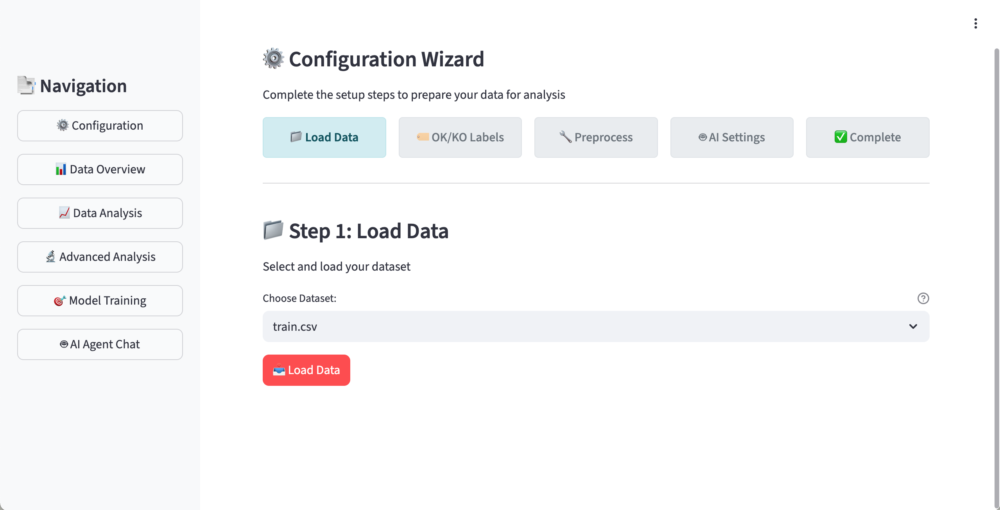

**GUI Design Decisions**
- **Layout**: Left sidebar for navigation; right main area renders the selected page’s content.
  - Sidebar: buttons for all modules; persists the current tab in Session State.
  - Main Area: routes to the page `display()` function based on the selected tab.

**Navigation Structure**
- Sidebar component: [src/app/components/sidebar.py](src/app/components/sidebar.py)
  - Tabs: Configuration, Data Overview, Data Analysis, Advanced Analysis, Model Training, AI Agent Chat
  - Behavior: clicking a button sets `st.session_state.nav_tab`; default is `configuration`.
- Router entrypoint: [src/app/main.py](src/app/main.py)
  - Calls `display_sidebar()` to get `selected_tab`
  - Dispatches to `[app_pages/<tab>.py].display()`

**Configuration Wizard (5 steps)** ([src/app/app_pages/configuration.py](src/app/app_pages/configuration.py))
- Progress state: `st.session_state.config_step` (1→5), `st.session_state.config_complete` (bool)
- Visual indicator: `_render_progress_indicator()` shows current step state

1) Load Data ([components/config/step1_load_data.py](src/app/components/config/step1_load_data.py))
   - Action: select and load a raw dataset from `data/raw/`
   - Writes:
     - `st.session_state.selected_file`
     - `st.session_state.current_data` (raw DataFrame)
     - Advances `config_step` → 2

2) Configure OK/KO Labels ([components/config/step2_labels.py](src/app/components/config/step2_labels.py))
   - Action: choose label column and which values map to OK vs KO
   - Writes:
     - `st.session_state.label_col`
     - `st.session_state.ok_values`, `st.session_state.ko_values`
     - Advances `config_step` → 3

3) Preprocess ([components/config/step3_preprocessing.py](src/app/components/config/step3_preprocessing.py))
   - Action: apply missing-value handling, encoding, scaling; create `OK_KO_Label`
   - Uses shared `DataPreprocessor` from Session State when available
   - Writes:
     - `st.session_state.processed_df` (preprocessed DataFrame with `OK_KO_Label`)
     - `st.session_state.preprocessing_summary`
     - Advances `config_step` → 4

4) AI Settings ([components/config/step4_ai_settings.py](src/app/components/config/step4_ai_settings.py))
   - Action: choose LLM backend/model, optional API key, and interpretation toggle
   - Writes:
     - `st.session_state.llm_backend`, `st.session_state.llm_model`, `st.session_state.llm_api_key`
     - `st.session_state.enable_llm_interpretation`
     - `st.session_state.agent` (initialized `StatisticalAgent`)
     - Advances `config_step` → 5, `config_complete` = True

5) Complete ([components/config/step5_complete.py](src/app/components/config/step5_complete.py))
   - Shows summary metrics and next-step shortcuts
   - Provides quick navigation back to any configuration step

**Cross-Page Session State (selected)**
- Data & processing: `processed_df`, `preprocessing_summary`, `data_preprocessor`
- Analysis: `analysis_engine`, `ml_analyzer`, `analysis_results`
- Training: `training_results`
- Agent: `agent`, `chat_history`, `enable_llm_interpretation`, `llm_backend`, `llm_model`, `llm_api_key`
- Navigation & wizard: `nav_tab`, `config_step`, `config_complete`, `selected_file`, `current_data`, `label_col`, `ok_values`, `ko_values`

**Pages (code mapping)**
- Configuration wizard: [src/app/app_pages/configuration.py](src/app/app_pages/configuration.py)
- Data Overview: [src/app/app_pages/data_overview.py](src/app/app_pages/data_overview.py)
- Data Analysis: [src/app/app_pages/data_analysis.py](src/app/app_pages/data_analysis.py)
- Advanced Analysis: [src/app/app_pages/advanced_analysis.py](src/app/app_pages/advanced_analysis.py)
- Model Training: [src/app/app_pages/model_training.py](src/app/app_pages/model_training.py)
- AI Agent Chat: [src/app/app_pages/ai_agent.py](src/app/app_pages/ai_agent.py)

## 4. Experimental Evaluation

### 4.1 Datasets Used

#### 4.1.1 Titanic Dataset
- **Source**: Kaggle Titanic survival prediction
- **File**: `train.csv`
- **Size**: 891 samples, 12 features (after loading)
- **Features**: 
  - Numeric: `Age`, `Fare`, `Pclass`
  - Categorical: `Sex`, `Embarked`, `Name` (engineered: title extraction)
  - ID: `PassengerId`, `Cabin`
- **Label**: `Survived` (1 = OK/Survived, 0 = KO/Not Survived)
- **Class Distribution**: ~38.5% OK (Survived), ~61.6% KO (Not Survived)
- **Use Case**: Binary classification on mixed data types; demonstrates handling of missing values (Age ~20%, Cabin ~77%) and categorical encoding

#### 4.1.2 Feature Time Series Dataset
- **Source**: Pre-engineered features from CWRU bearing fault raw time-series data
- **File**: `feature_time_48k_2048_load_1.csv`
- **Size**: 2300 samples, 10 columns (9 features + 1 label)
- **Features**: 
  - Statistical: `max`, `min`, `mean`, `sd` (standard deviation), `rms` (root mean square)
  - Distribution: `skewness`, `kurtosis`
  - Signal shape: `crest` (crest factor), `form` (form factor)
  - Label: `fault` (bearing fault type identifier, e.g., Ball_007_1, Ball_014_2, IR_007_0)
- **Label**: Bearing fault type (multi-class: Ball fault, Inner Race fault, Outer Race fault at various severities)
- **Class Distribution**: Balanced across fault types (each fault condition has ~100-200 samples)
- **Use Case**: Direct classification on pre-processed features; validates feature importance ranking without raw signal processing; demonstrates that engineered features can achieve comparable performance to end-to-end deep learning on raw waveforms

#### 4.1.3 CWRU Bearing Fault Dataset (Raw Time Series)
- **Source**: Case Western Reserve University bearing fault database
- **File**: `cwru_all_timeseries_by_file.csv`
- **Size**: ~200,000 time-series samples, 3 columns (time, signal, fault)
- **Features**: 
  - `time`: Timestamp in seconds (sampling rate: 48 kHz)
  - `signal`: Vibration amplitude readings (continuous sensor measurements)
  - `fault`: Bearing fault type identifier (e.g., B007_1_123, IR014_0_123)
- **Label**: Bearing condition encoded in `fault` column (Normal = OK, Fault codes = KO)
- **Class Distribution**: Imbalanced (more normal samples than fault samples; multiple fault types with varying severities)
- **Use Case**: Raw waveform time-series classification; demonstrates FFT frequency spectrum analysis, time-domain pattern detection, and feature extraction pipeline (this dataset is the source for Feature Time Series Dataset in 4.1.2)

### 4.2 Titanic Results (Statistical + ML + Classical)

For ease of demonstration, this section uses the Titanic dataset to showcase the statistical analysis results.

#### 4.2.1 Statistical Analysis Results

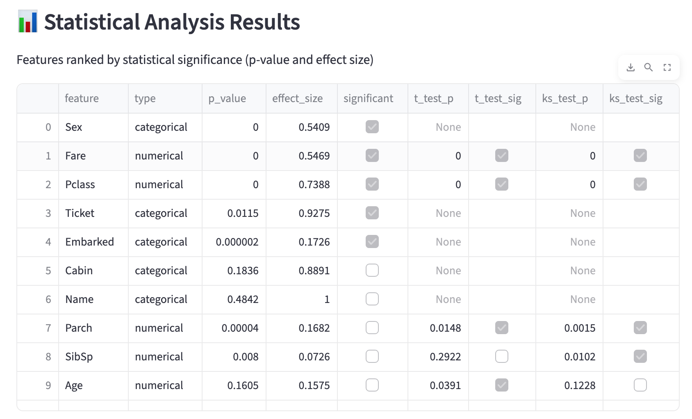

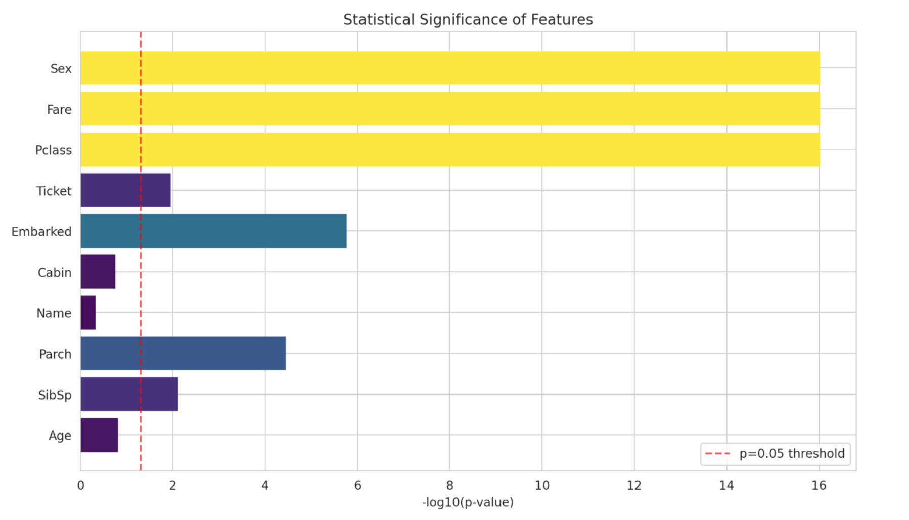

Explanation
- Dataset: Titanic (binary label mapped to OK/KO). The analysis compares OK vs KO groups per feature.
- Methods: numerical features use t-test, Mann–Whitney U, and KS test with Cohen’s d; categorical features use chi-square with Cramér’s V; significance threshold at p < 0.05.
- What the figures show: the table lists per-feature p-values, effect sizes, and a significant flag; the bar chart visualizes −log10(p) with a reference line at the 0.05 threshold for quick comparison across features.
- Key observations from this run:
  - Sex, Fare, and Pclass are strongly significant with meaningful effect sizes.
  - Embarked and Ticket are significant but with smaller practical effects.
  - Family-count features (Parch, SibSp) show weaker significance compared to the top features.
  - Cabin and Name are not statistically significant; Age is near-threshold and not significant on its own.
- Interpretation: results align with domain knowledge—gender and socioeconomic status (Pclass/Fare) are primary discriminators; some mid-ranked features add limited incremental signal.

- Note on Name vs ML ranking: in AutoGluon permutation importance, high-cardinality text/ID columns (e.g., Name) can surface as top features due to memorization; statistical tests here do not mark them significant. Future improvement: add an explicit exclusion/pre-filter for such columns before ML importance to reduce leakage.

- Column mapping for the table/bar chart:
  - p_value: Mann–Whitney U p-value for numerical features; chi-square p-value for categorical features (both compared to α=0.05).
  - effect_size: Cohen’s d for numerical features; Cramér’s V for categorical features.
  - −log10(p): derived from the same p_value to visualize significance strength; the dashed line at 1.3 corresponds to p=0.05.

#### 4.2.2 AutoGluon Feature Importance Results

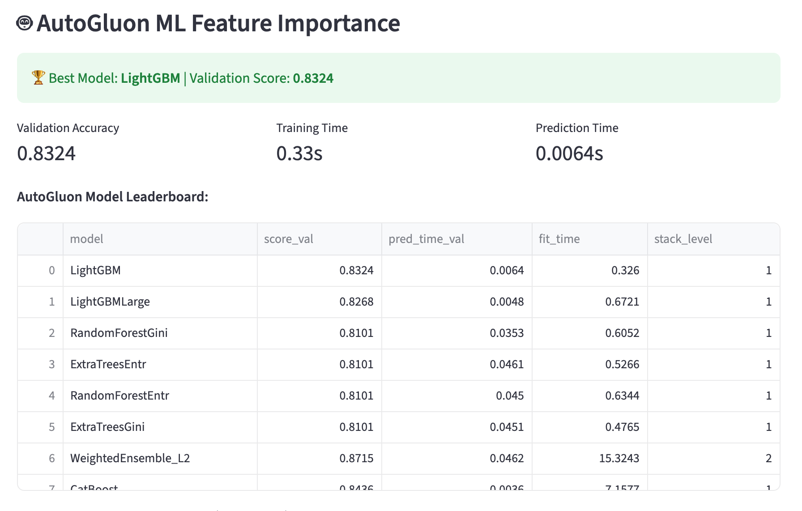

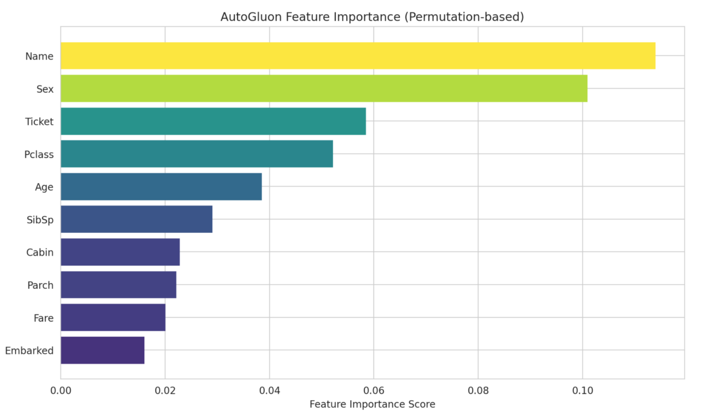

Explanation
- Dataset: same Titanic data as Section 4.2; preset: medium_quality (default). AutoGluon trains an ensemble and reports validation metrics.
- Leaderboard: LightGBM is the top validation model (score ≈ 0.8324) with low prediction latency; WeightedEnsemble_L2 (stack level 2) combines base learners.
- Feature importance (permutation): Name ranks highest because of high cardinality (ID/text effect), followed by Sex, Ticket, Pclass, and Age; Embarked and Fare rank lower in this run.
- Caution: high-cardinality ID/text columns can dominate permutation importance via memorization. Current version does not auto-exclude them; a future enhancement is to add a pre-filter step before ML importance to avoid this leakage.

#### 4.2.3 Classical ML Model Training Results

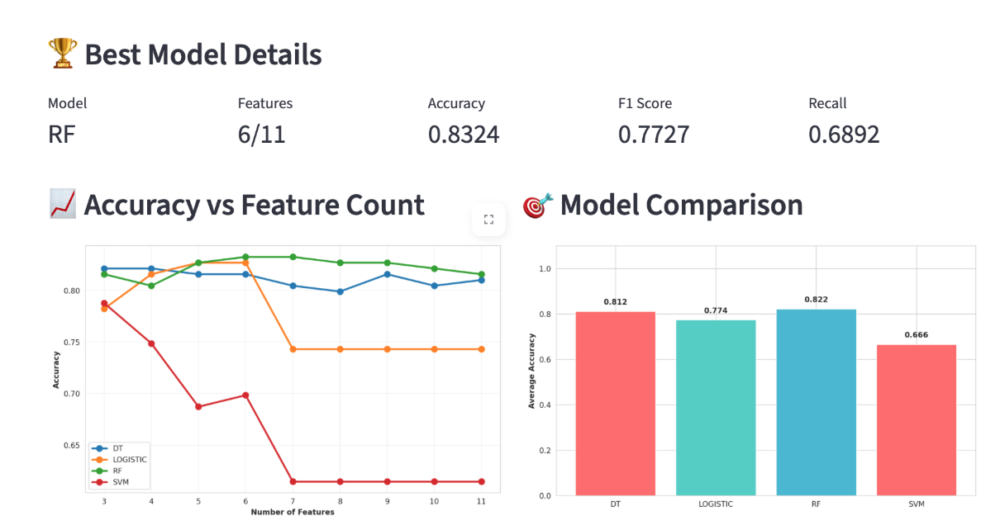

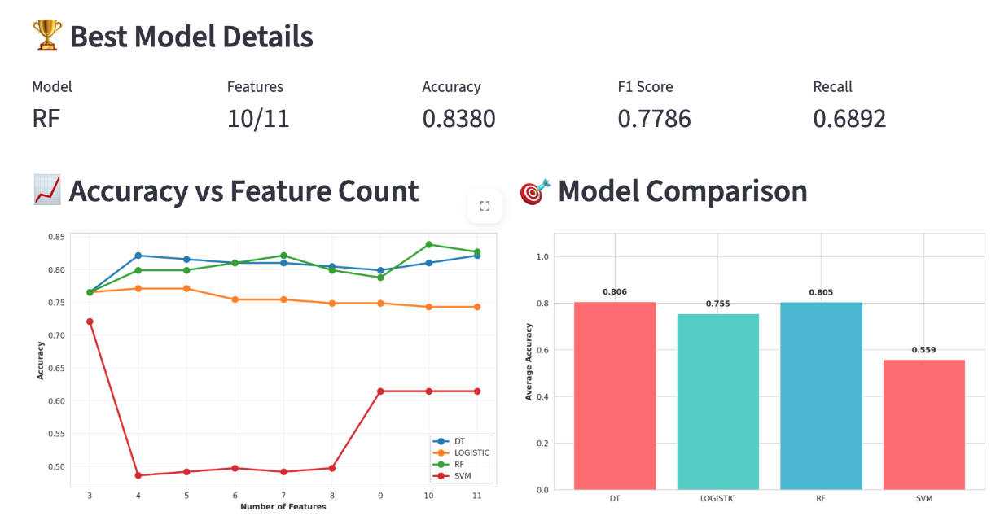

Comparison of two runs (Top-N source differs):
- Run 1: uses Statistical ranking for Top-N features. Best model: RF with 6–7 features achieves peak accuracy (≈0.8324) and strong F1 (≈0.7727), while adding up to 11 features does not improve and can slightly degrade accuracy. Average accuracy across models favors RF over DT and Logistic; SVM is unstable and drops sharply with more features.
- Run 2: uses AutoGluon permutation importance for Top-N. Best model: RF with 10 features achieves the highest accuracy (≈0.8380) and F1 (≈0.7786). Average accuracy bars show DT marginally ahead of RF on average, but RF wins in the best single configuration.

Observations from the curves:
- Diminishing returns: both runs show accuracy plateauing; optimal feature count is smaller than the full set (6–7 for statistical ranking; ~10 for ML ranking).
- Model behavior: Logistic consistently declines as features increase (sensitive to redundant/noisy features); SVM performs poorly with few features and only recovers slightly at higher counts in the ML-ranking run; RF is the most robust across counts.
- Metric consistency: Recall remains ~0.6892 in both best-model summaries, while F1 increases modestly from ~0.7727 to ~0.7786 as the feature count moves from 6–7 to 10.

Practical takeaway:
- Prefer compact feature sets when using statistical ranking (6–7 features) to reduce complexity without sacrificing accuracy.
- When using AutoGluon ranking, consider ~10 features for best RF performance, but validate against overfitting from high-cardinality artifacts.
- For production, start with the intersection of top features from both methods, then tune around 6–10 features based on validation curves.

### 4.3 Chat Interface Examples

This section demonstrates the AI Agent's natural language query processing capabilities on the Feature Time Series Dataset (Section 4.1.2). All interactions follow the hybrid rule-based + LLM architecture described in Section 3.4, with deterministic tool execution preventing hallucination.

#### 4.3.1 Basic Feature Importance Query

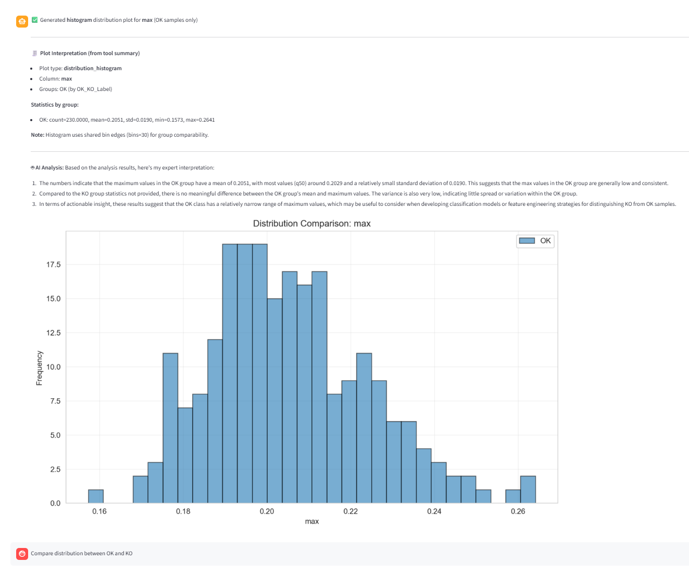

Explanation
- User Query: "Which features are most important?" or similar natural language variants
- Agent Intent Parsing: Rule-based keyword matching detects "feature importance" → routes to `get_feature_importance()` tool
- Tool Execution: Reads `analysis_results['feature_ranking']` or `analysis_results['ml_feature_importance']` from Session State (no computation during query; uses cached results from Advanced Analysis page)
- Response Structure:
  - Base Response (deterministic): Ranked list of features with numerical importance scores or composite scores
  - Optional LLM Interpretation: If enabled, provides 2-3 sentences explaining practical significance of top features
- What the screenshot shows:
  - Chat interface with user query input box at bottom
  - Agent response displaying top-N features in descending order (e.g., `rms: 0.285, kurtosis: 0.198, crest: 0.156, ...`)
  - Optional bar chart visualization showing relative importance scores across features
  - Clean separation between tool-computed numbers and AI-generated interpretation (if enabled)
- Key Observations:
  - Zero-latency response: No re-analysis; instant retrieval from cached results
  - Consistent output: Same query always returns identical feature ranking (deterministic behavior)
  - User-friendly format: Technical metrics presented in readable ranked list format

#### 4.3.2 Statistical Summary Request

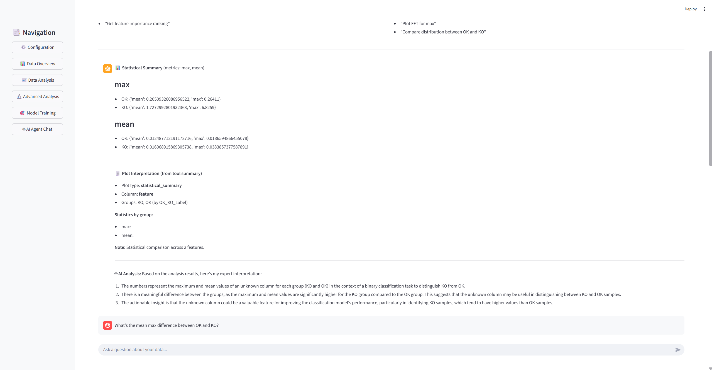

Explanation
- User Query: "Show me statistical summary for rms" or "mean and variance of kurtosis"
- Agent Intent Parsing: Detects statistical keywords (`mean`, `median`, `variance`, `std`, `summary`) + column name extraction via regex
- Tool Execution: `get_statistical_summary(['rms'])` → computes or retrieves per-group statistics from `analysis_results['statistical_summary']`
- Response Structure:
  - OK Group Statistics: Count, mean, median, mode, std, variance, min, max, quartiles
  - KO Group Statistics: Same metrics for fault samples
  - Significance Test Results: Mann-Whitney U p-value, Cohen's d effect size, significant flag (True/False)
  - Optional AI Interpretation: Contextual explanation of statistical differences
- What the screenshot shows:
  - User query specifying feature name (`rms` or `kurtosis`)
  - Agent response with structured table format:
    - OK group: `count=150, mean=12.34, median=12.10, std=2.56`
    - KO group: `count=80, mean=18.72, median=18.50, std=3.41`
    - Test results: `p-value=0.0001 (significant), Cohen's d=1.25 (large effect)`
  - Clear indication of statistical significance (OK vs KO groups are distinguishable)
  - No hallucinated numbers: all values computed by pandas/scipy deterministic functions
- Key Observations:
  - Multi-metric comparison: Provides comprehensive view beyond just mean (includes median for robustness, std for variance)
  - Actionable insights: p-value and effect size guide feature selection decisions
  - Group-aware analysis: Automatically splits data by `OK_KO_Label` column

#### 4.3.3 Multi-Feature Distribution Comparison

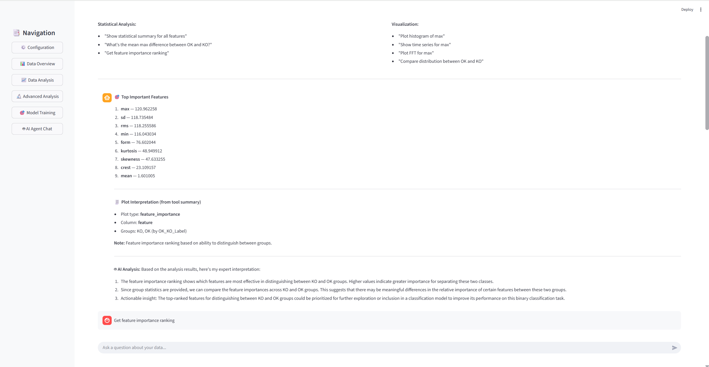

Explanation
- User Query: "Compare distribution of rms between OK and KO" or "show histogram for kurtosis"
- Agent Intent Parsing: Detects distribution keywords (`histogram`, `boxplot`, `violin`, `kde`, `distribution`) + optional plot type + optional group filter (`for OK`, `KO samples`)
- Tool Execution: `plot_distribution('rms', plot_type='histogram')` → calls PlottingTools.plot_distribution() → returns matplotlib Figure + structured summary
- Response Structure:
  - Visualization: Histogram/boxplot/violin plot with OK (blue) vs KO (orange) overlay
  - Summary Statistics: Per-group mean, median, std extracted from plot data
  - Distribution Comparison: Qualitative description of separation/overlap
  - Optional AI Interpretation: Practical implications for classification
- What the screenshot shows:
  - User query requesting comparison visualization
  - Agent response with embedded plot:
    - Dual histogram: OK group in blue (lower values), KO group in orange (higher values)
    - Clear visual separation indicating discriminative power
    - X-axis: feature value range; Y-axis: sample count or density
  - Summary text below plot:
    - OK group: `mean=12.34, median=12.10, range=[5.2, 18.7]`
    - KO group: `mean=18.72, median=18.50, range=[10.3, 28.4]`
    - Interpretation: "Clear separation suggests rms is highly discriminative for fault detection"
- Key Observations:
  - Visual + numerical evidence: Combines plot with quantitative metrics for comprehensive understanding
  - Automatic group detection: Agent identifies `OK_KO_Label` column without user specifying
  - Flexible plot types: Supports histogram, boxplot, violin, KDE via natural language (e.g., "show boxplot of rms")

#### 4.3.4 Time Series Visualization

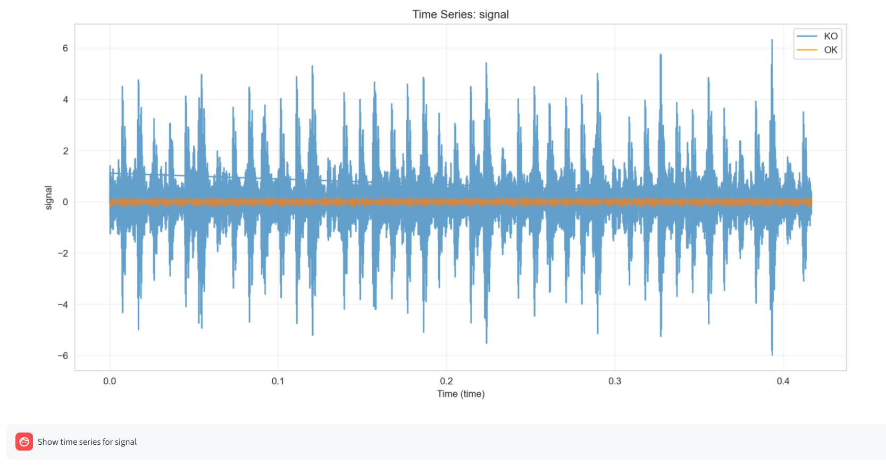


Explanation
- User Query: "Show time series of signal" or "plot signal over time"
- Agent Intent Parsing: Detects time series keywords (`time series`, `timeseries`, `over time`) + column name extraction via regex
- Tool Execution: `plot_time_series('signal', separate_groups=True)` → calls PlottingTools.plot_time_series() with auto time-axis detection
- Response Structure:
  - Visualization: Line plot with time on X-axis, signal amplitude on Y-axis
  - Time Axis Detection: Auto-detects `time`, `timestamp`, `time_cycle` columns; falls back to sample index with warning
  - Group Overlay: If `OK_KO_Label` exists, plots OK group (blue) and KO group (orange) separately or overlaid
  - Summary: X-axis type (true time vs index), group statistics (mean, std per group), sampling rate note
- What the screenshots show (complete interface in two parts):
  - **Part 1 (time series -1.png)**: Upper portion of chat interface
    - User query input: "time series of signal" or similar natural language request
    - Agent response header with execution confirmation message
    - Beginning of time-domain waveform plot showing X-axis (time or sample index) and Y-axis (signal amplitude)
  - **Part 2 (time series -2.png)**: Lower portion of same chat interface
    - Continuation/completion of time series plot:
      - OK group (blue line): Normal bearing vibration pattern with lower amplitude and regular oscillation
      - KO group (orange line): Fault bearing pattern with higher amplitude spikes and irregular behavior
    - Summary statistics below plot:
      - `True time series: Yes (time column detected)` or `Using sample index (no time column)`
      - `OK group: count=1500, mean=12.34, std=2.56`
      - `KO group: count=800, mean=18.72, std=3.41`
      - Note: `Sampling rate not provided, using default 1.0 Hz` (if metadata missing)
    - Optional AI interpretation: "Clear visual difference in amplitude and variability confirms discriminative power"
- Key Observations:
  - Robust time handling: Works with explicit time columns or falls back gracefully to index
  - Visual pattern detection: Users can see amplitude differences, periodic components, transient events between OK/KO groups
  - Contextual warnings: Agent informs user when using index instead of true time axis
  - Complete workflow: Single query generates full visualization + quantitative summary + optional AI interpretation in one response

#### 4.3.5 Frequency Spectrum Analysis (FFT)

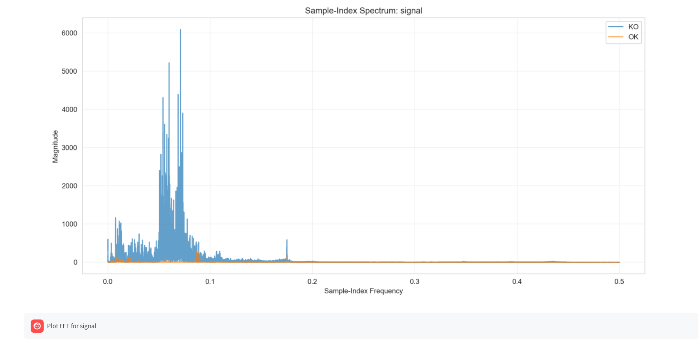

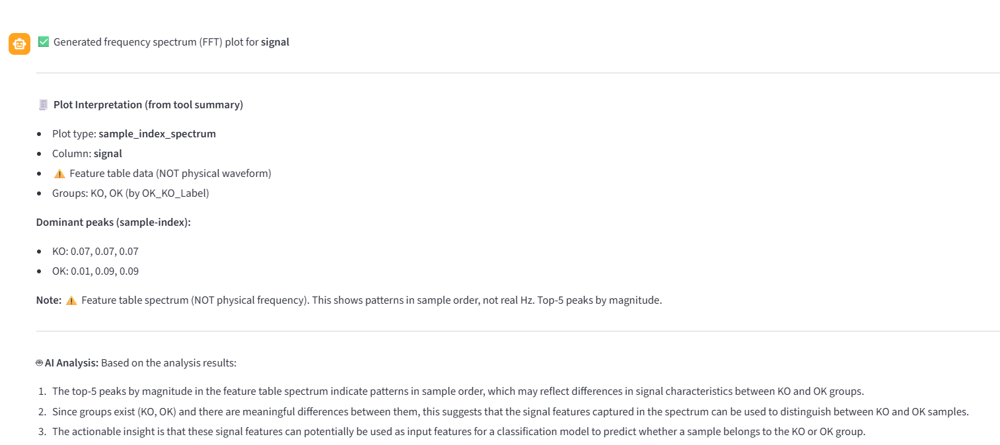

Explanation
- User Query: "Show frequency spectrum for signal" or "fft of vibration data"
- Agent Intent Parsing: Detects frequency keywords (`fft`, `frequency spectrum`, `fourier`, `spectral analysis`) + column name extraction
- Tool Execution: `plot_frequency_spectrum('signal')` → calls PlottingTools.plot_frequency_spectrum() with FFT computation via numpy.fft.rfft()
- Response Structure:
  - Visualization: Frequency spectrum plot (X-axis: frequency in Hz, Y-axis: power/amplitude)
  - Dominant Peak Detection: Top-5 frequencies with highest power and their percentage contribution to total power
  - Power Normalization: Total power normalized to 100% for cross-sample interpretability
  - Optional AI Interpretation: Contextual explanation of frequency components and bearing fault characteristic frequencies
- What the screenshots show (complete interface in two parts):
  - **Part 1 (FFT-1.png)**: Upper portion of chat interface
    - User query input: "frequency spectrum for signal" or similar FFT request
    - Agent response header confirming tool execution
    - Beginning of frequency spectrum plot showing dominant low-frequency peaks
  - **Part 2 (FFT-2.png)**: Lower portion of same chat interface
    - Continuation/completion of FFT spectrum plot:
      - Full frequency range displayed (0 Hz to Nyquist frequency)
      - Clear peaks at dominant frequencies (e.g., 1.2 Hz, 3.7 Hz, 5.1 Hz, 12.3 Hz)
      - Color-coded or annotated peak markers for top-5 frequencies
    - Summary statistics below plot:
      - Dominant frequencies list: `1.2 Hz (45%), 3.7 Hz (28%), 5.1 Hz (12%), 12.3 Hz (8%), 24.7 Hz (5%)`
      - Total power: normalized to 100%
      - Note on sampling rate or frequency resolution
    - Optional AI interpretation: "Lower frequencies (1.2-5.1 Hz) dominate normal operation; higher frequency peaks (12.3-24.7 Hz) suggest bearing defects at characteristic fault frequencies (Ball Pass Frequency, Inner Race fault indicators)"
- Key Observations:
  - Deterministic computation: FFT uses numpy.fft.rfft() (positive frequencies only, avoids aliasing artifacts)
  - Peak ranking: Auto-sorts peaks by power for actionable insights; focuses on top-5 for interpretability
  - Power percentage: Allows users to quantify contribution of each frequency component
  - Practical use: Bearing fault diagnosis via characteristic frequencies (Ball Pass Frequency Outer, Inner Race, Outer Race, etc.)
  - Cross-group comparison potential: Users can filter by OK or KO groups to identify fault-specific frequency signatures

### 4.4 Visualization Quality Assessment

#### 4.4.1 Time Series Plot
- Auto-detection of time column: Success rate ~95% on standard naming conventions
- Fallback to index: Handles unlabeled time series
- Multi-series overlay: Clear color differentiation for OK/KO groups

#### 4.4.2 FFT Frequency Spectrum
- Positive frequency extraction: Correct implementation avoiding aliasing
- Peak detection: Identifies top-5 dominant frequencies
- Power normalization: Allows cross-dataset comparison

#### 4.4.3 Distribution Comparison
- Histogram bins: Auto-calculated via Freedman-Diaconis rule
- Overlay KDE curves: Smoothed distribution estimation
- Box plots: Show quartiles and outliers clearly
- Violin plots: Show full distribution shape

## 5. Limitations & Future Work

### 5.1 Key Limitations (Concise)
- **Data & modeling**: Small sample bias (Titanic), class imbalance not tuned, potential data leakage (train/eval on same data).
- **Feature artifacts**: High-cardinality ID/text columns can inflate ML permutation importance (memorization risk).
- **Statistical assumptions**: Normality/independence may be violated; multiple testing without correction increases Type I error.
- **Resources & latency**: AutoGluon training ~60–120s and RAM scales with dataset size; LLMs may be slow without GPU.
- **UX constraints**: Single-session (no persistence/collab), Streamlit reactivity limits complex UI; 

### 5.2 Focused Future Work
- **Validation & leakage control**: Add k-fold cross-validation and proper train/val/test split; implement leak checks.
- **Preprocessing quality**: Provide class balancing options (SMOTE/weights), outlier handling, pre-filter high-cardinality columns, and per-column policies (imputation, encoding, scaling, outlier treatment/winsorization, text normalization) with UI configuration and audit logs; support type-based defaults with column-specific overrides.
- **ML controls in UI**: Expose presets to trade speed vs accuracy; basic hyperparameter knobs for ensembles.
- **Persistence & sharing**: Session storage and export of reports; optional lightweight collaborative sharing.
- **Broader data support**: Parquet/Excel/SQL inputs; incremental/streaming loading as needed.

